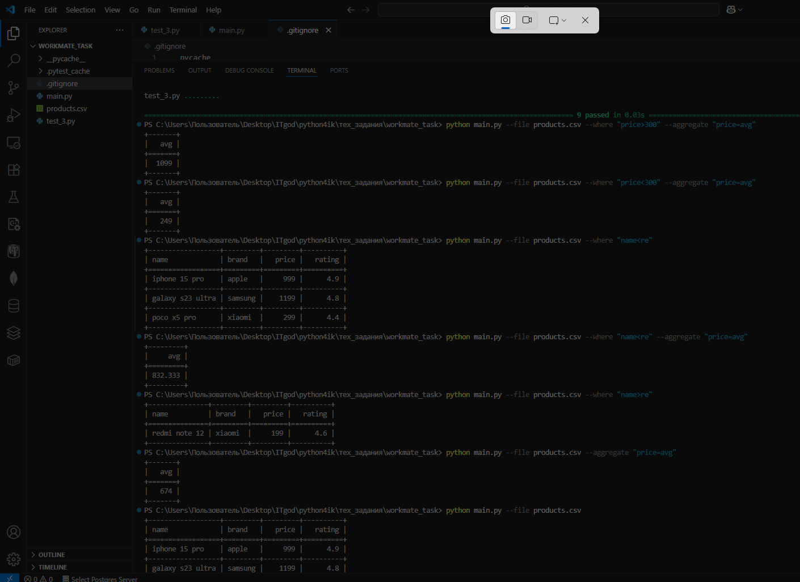

  
*Пример интерфейса приложения*
  
*Пример интерфейса приложения*

Можете протестировать вручную. Например, так: 
```Bash
pytest
python main.py --file products.csv --aggregate "price=avg"
python main.py --file products.csv --where "price>300" --aggregate "price=avg"
python main.py --file products.csv --where "brand>apple"
```